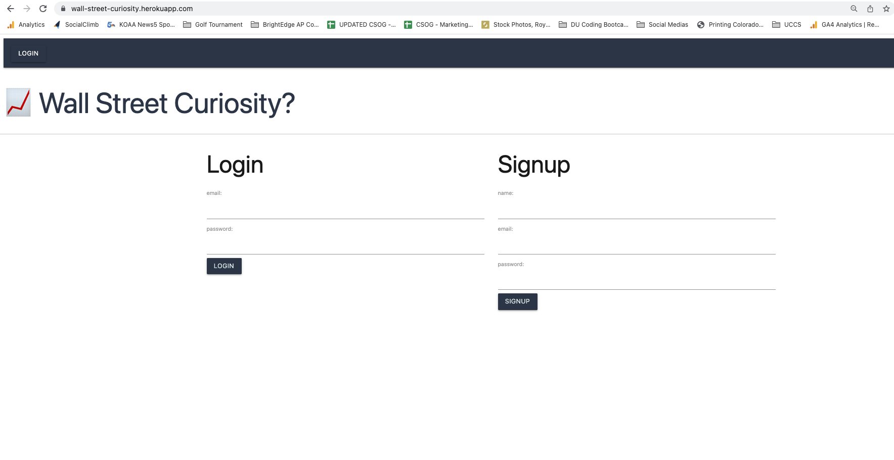
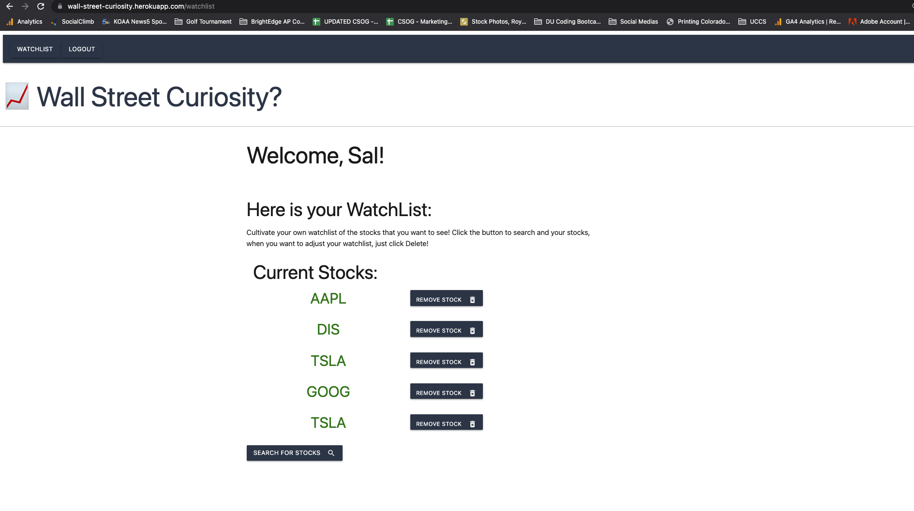
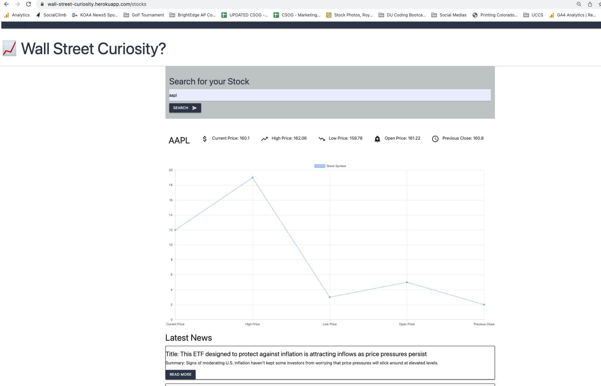

# Project 2
## Wall Street Curiosity

### User Expectation
What to expect with the completed Application:
* As a user, I want to be able to login in to a webiste where I can view my saved watchlist of stocks.

* As a user, when I view my watchlist, I will have the option to click on a stock and see the Stock Name, Current Price, High Price, Low Price, Open, and Previous Close. I will also see 2 buttons where I can "ADD A STOCK" and "DELET A STOCK".

* As a user, I will be able to "ADD A STOCK" and I can search using a stocks ticker symbol.

* As a user I will be able to "DELETE A STOCK".

* As a user I can "Logout".


What you should expected to find as a User of the application:
```
WHEN I click "Login" 
THEN I am presented with the option to either Login or Create a New User
WHEN I am either Logged In or have Created a New User
THEN I am presented with my Watchlist of saved stocks where I can click on a stock to view its different daily prices and 2 buttons to either ADD or DELETE a stock
WHEN I click "ADD A STOCK"
THEN I am presented with a search bar to search by ticker symbol where I will get the Stock Name, Current Price, High Price, Low Price, Open, Previous Close, and the 5 most recent news articles
WHEN I click "DELETE A STOCK"
THEN I am ask which ticker symbol to delete.
WHEN I click "Logout"
THEN I am taken to the Homepage
```
### Application Tutorial
Open `server.js` in your integrated terminal and run `npm i`.
Then run `npm run seed` to seed data to your database.

Open the `schema.sql` file in the `db` folder to create your database with MySQL shell commands.

### API's Used for Project
Finnhub was used for searching with the stock ticker as well as getting the current price information.
(https://finnhub.io/docs/api/introduction)

AlphaVantage was use to search for the 5 most recent articles.
(https://www.alphavantage.co/documentation/)

Chartjs for stock information
(https://www.chartjs.org/)

### Technologies Used
Here is a list of techonologies used in the applicaiton:
* Heroku - Used for Deployment
* VS Code - app developement
* Insomnia - testing of app CRUD results
* Github - app repository
* MySQL - database development
* Express.js - to create RESTful API
* Node.js - to create RESTful API
* Sequelize ORM
* Handlebars.js
* User Authentication - including express sessions and cookies

### Screenshots of Website




### Links to Deployed Application
[Github for Wall Street Curiosity](https://github.com/Jsalazar99/wall-street-curiosity)

[Heroku for Wall Street Curiosity](https://wall-street-curiosity.herokuapp.com/)

*Created in collaboration with Johnny McGown, Katherine Reiner, Jesus Salazar, and Chelsey Valerio*